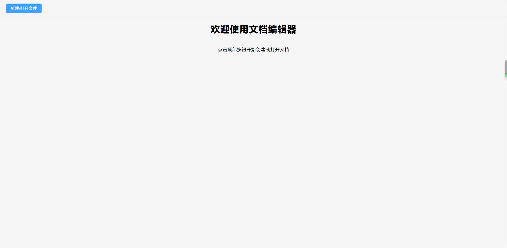
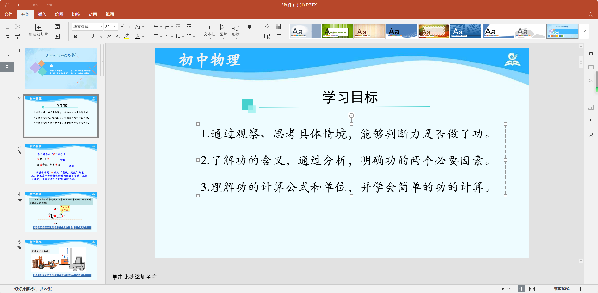
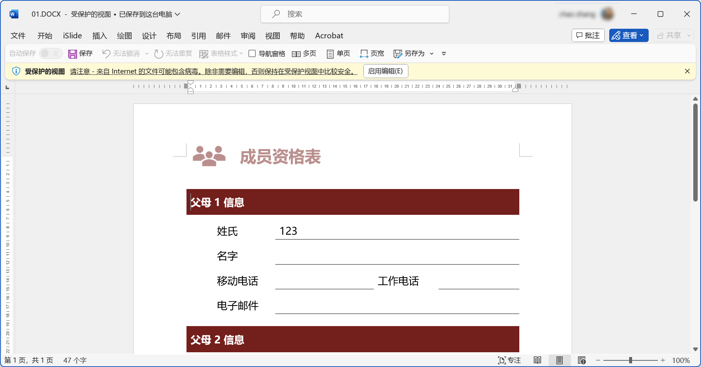

# office-web-local

基于only-office的纯本地项目，支持本地`打开、编辑`office文档

[live-demo🪄](https://sweetwisdom.github.io/onlyoffice-web-local/)


## 📄 打开远程文件

### 功能说明

通过路由参数自动下载并打开远程 Office 文件（如 `.docx`、`.pptx` 等），并将其转换为 `File` 对象供后续使用（如预览或编辑）。

### 使用方法

页面地址需包含以下参数：

* `url`（必填）：远程文件地址
* `filename`（可选）：文件名，如果未提供将尝试自动解析

示例：
[00.xlsx](https://sweetwisdom.github.io/onlyoffice-web-local/#/?url=https://sweetwisdom.github.io/react-filePreview/filePreview/00.xlsx)

```
?filename=00.pptx&url=https://example.com/files/00.pptx
```

### 文件名获取优先级

1. 路由参数 `filename`
2. 从 `url` 中解析
3. 从响应头 `Content-Disposition` 提取

若无法获取文件名，将终止操作并提示错误。


## word



## excel


## ppt




## 导出文档



## 开发支持

```sh
pnpm install
```

### Compile and Hot-Reload for Development

```sh
pnpm dev
```

### Type-Check, Compile and Minify for Production

```sh
pnpm build
```

## Docker 支持

自定义镜像名为 vue-local-office 的镜像（请注意下面命令末尾有一个点 . 表示使用当前路径下的 Dockerfile 文件，可根据实际情况指定路径）

docker build -t vue-local-office .

端口映射并启动 docker 容器（8080:80：表示在容器中使用 80 端口，并将该端口转发到主机的 8080 端口；local-office：表示自定义容器名；vue-local-office：表示自定义镜像名）

docker run -dp 8080:80 --name local-office vue-local-office

操作完上面两个命令后，在浏览器打开 http://localhost:8080 即可预览

## 技术原理

使用x2t-wam替代onlyofice服务

使用only-office websdk  实现编辑(来自se-office)

## 参考

[Qihoo360/se-office: se-office扩展，提供基于开放标准的全功能办公生产力套件，基于浏览器预览和编辑office。](https://github.com/Qihoo360/se-office)

[cryptpad/onlyoffice-x2t-wasm: CryptPad WebAssembly file conversion tool](https://github.com/cryptpad/onlyoffice-x2t-wasm)

